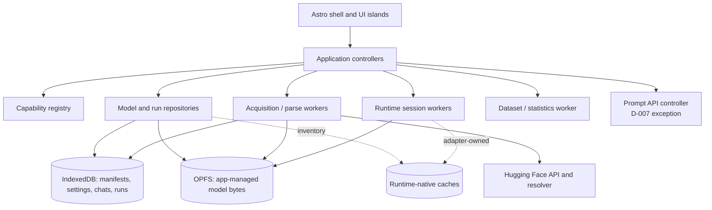

# Architecture

**Status: first full draft.** This document fixes the application boundaries and the
contracts M1 onward build against. Details may change when implementation produces
evidence, but changes to the runtime contract, storage ownership, worker boundary, or
measurement semantics are architecture decisions and must be recorded rather than
drifting silently.

## Architectural goals

WebAI is a static, fully client-side workbench. Its architecture optimizes for four
properties:

1. **Honest capability reporting.** Availability is a conclusion with evidence and a
   reason, not a browser-name check or a runtime marketing claim.
2. **Replaceable runtimes.** Chat, benchmarks, and model management depend on WebAI
   contracts; runtime-specific capabilities remain visible instead of being flattened
   into a false lowest common denominator.
3. **Recoverable local work.** Large transfers and transformations checkpoint durable
   state, verified artifacts are never confused with partial ones, and missing or
   evicted browser storage is an expected state.
4. **A responsive UI.** The window renders and coordinates. Downloads, parsing,
   hashing, transformation, tokenization, inference, dataset processing, and
   statistics execute in workers, except for the browser-managed Prompt API exception
   in D-007.

## Fixed constraints

- Astro builds a static site at the root of `https://webai.meenan.dev/`; there is no
  application server (D-024, superseding D-001's original base path).
- Production serves the whole app with COOP `same-origin` and COEP `require-corp`, but
  code still probes `crossOriginIsolated` (D-012).
- Model traffic goes only to Hugging Face or the user-selected Chrome model flow.
  Runtime code, workers, wasm, and compiled model libraries are pinned, audited,
  content-hashed application assets served from the dedicated origin (D-005).
- Models, remote metadata, and model output are untrusted. Parsers use bounded reads,
  schemas reject malformed records, and UI rendering treats all strings as text
  (D-006).
- Chrome is the primary target, with feature-by-feature probes and explained fallback
  behavior in other browsers; there is no user-agent gate (D-004).
- OPFS, IndexedDB, Cache Storage, quota, and persistence are origin-scoped. The
  dedicated origin is WebAI's browser storage/security boundary; internal names stay
  versioned and `webai`-prefixed for collision and migration hygiene (D-024).

## System shape

The controllers are small state machines shared by chat, model management, and the
benchmark UI. They validate commands, supervise worker lifecycles, and translate
worker events into immutable UI state. They do not perform heavy work.

The codebase preserves module boundaries for `capabilities`, `models`, `storage`,
`runtimes`, `chat`, and `benchmarks` as those modules land. Heavy adapters and their
catalogs are dynamic imports behind their gates, so the shell and capability report do
not download inference engines.

## Runtime adapter contract

### Identity and descriptors

A runtime is identified by a stable WebAI adapter ID and records both adapter/package
and underlying engine versions. A loadable `ModelTarget` is a discriminated reference:

- `artifact-set` identifies WebAI-managed files by immutable content identities and
  derivation, with remote revision/provenance when applicable;
- `native-cache` identifies an adapter-owned cache entry by stable adapter/native keys
  and logical source identity; observed integrity/guarantee state is attached evidence,
  not part of target identity; and
- `browser-managed` identifies an adapter/browser model choice without pretending it
  has files or WebAI-owned bytes; observable availability/acquisition state is mutable
  evidence attached to that reference, not part of its identity.

An `ArtifactSet` is not merely a format string. Its immutable identity contains the
ordered file roles and content identities plus derivation source/transformation
identity. Its inspected descriptor records architecture, format, quantization, shard
relationships, tokenizer, processor, chat template, and multimodal projector
dependencies. Optional speculative-decoding artifacts use an explicit role (for
example `mtp-head` or `draft-model`) and compatibility edge to their target; they are
never folded into target shards or treated as supported merely because both files are
installed. A runtime binding also records compiled model-library identity where
required. Changing derived inspection evidence does not rename unchanged bytes.

Compatibility is derived evidence, not artifact identity. It is keyed by model-target
identity, adapter/engine versions, probe version, and relevant environment fingerprint.
The manifest may cache candidate compatibility, but successful inspection and session
creation are the final gates. Format alone never proves compatibility.

Each adapter has a lightweight descriptor available without loading its engine:

- display metadata and pinned versions;
- acquisition ownership: `app-file`, `library-cache`, `app-asset-library-cache`, or
  `browser-managed`;
- execution context: `worker` or `browser-managed-main-thread`;
- possible backend configurations and their environment requirements; and
- supported artifact families and optional features.

### Operations

The logical interface is versioned independently of any worker transport. It exposes:

1. `probe(environment)` — refine the static descriptor using current environment
   evidence without acquiring a model.
2. `inspect(modelTarget)` — defensively parse an artifact set, reconcile a native-cache
   target, or probe browser-managed availability as its variant permits; returns
   model-specific compatibility, dependencies, chat-template support, modalities,
   limits, and structured-output strength without requiring fictitious files.
3. `acquire(request)` — only for native-cache or browser-managed targets whose
   acquisition cannot use the shared download manager; reports durable or browser-
   observable progress, result state, and inventory records through the model
   repository.
4. `createSession(modelTarget, backend, options)` — returns a typed `SessionHandle`,
   requested/effective configuration and session capabilities, or a typed failure. A
   backend is structured data: for example, wllama thread count and GPU offload are
   independent fields.
5. `generate(sessionHandle, request)` — emits an ordered stream of lifecycle, text/token,
   usage, metric, warning, completion, or error events. Request IDs make late events
   from an aborted generation harmless.
6. `abort(sessionHandle, requestId)`, `disposeSession(sessionHandle)`, and
   `disposeAdapter()` — idempotent lifecycle operations with bounded shutdown followed
   by worker termination if the runtime does not cooperate. Handles are opaque,
   adapter-scoped, and invalid after disposal or worker restart.
7. `inventory()` — reports native-cache entries, byte counts and confidence, source
   identities, and eviction/missing state where the adapter can observe them.

Worker messages use a discriminated, schema-validated protocol carrying a protocol
version, adapter ID, session ID, request ID, and sequence number. Unknown message
variants fail closed with a diagnostic. Errors cross the boundary as typed error data
(`code`, safe message, retryability, phase, optional cause code), never as trusted HTML
or an assumption that an `Error` object clones faithfully.

Generation requests distinguish common controls from adapter extensions. An adapter
returns which requested controls it honored, changed, or cannot support. The same
rule applies to token counts and templates: runtime-native values are preserved and
their source is recorded.

### Capability vocabulary

Runtime capability is the intersection of environment, adapter, model target, and
active session—not a boolean on the adapter. Each capability verdict is one of `supported`,
`degraded`, `unsupported`, or `unknown` and carries:

- the requirement and evidence that produced the verdict;
- a stable reason code plus user-facing explanation;
- the requested and effective configuration when relevant; and
- remediation, if the user can change the outcome.

Modalities, tool templates, and constrained generation are model-scoped. Structured
output uses a set rather than a strength hierarchy: `prompt-and-validate`,
`json-schema-constrained`, `grammar-constrained`, and `tool-template`. A runtime may
support more than one, and tool-template support is not mislabeled as constrained
decoding.

Speculative decoding is likewise a structured, session-scoped capability. Its
evidence identifies the method (`mtp-head`, generic `draft-model`, or an adapter-
specific method), companion identity and compatibility, whether the app can toggle
it, exposed draft/acceptance metrics, and unavailable reason. Browser-internal
behavior that WebAI cannot select or compare is not reported as supported.

## Worker topology and lifecycle

There is no universal runtime host worker. The adapter controller chooses one of
three supervised patterns while exposing the same logical contract:

- **Direct worker adapter.** WebAI starts a dedicated module worker containing the
  runtime, used when the library supports that arrangement.
- **Adapter-owned library worker.** When a library already supplies its inference
  worker (for example wllama), the adapter owns that worker directly rather than
  nesting it inside another worker just for uniformity.
- **Browser-managed main-thread adapter.** Prompt API calls run from its window
  controller because the API is unavailable in workers. This remains the only D-007
  exception and is marked on every affected measurement.

By default each active runtime session has an isolated worker lifecycle. This makes
abort, device-loss recovery, memory reclamation, and side-by-side comparisons
predictable. An adapter may deliberately multiplex sessions only after measurement
shows the engine safely supports it; the result records that shared execution scope.

Other worker responsibilities are separate:

- an acquisition pipeline worker owns each active download/import transformation and
  performs range validation, durable writes, incremental hashing, parsing, and—when
  M3 proves it feasible—streaming GGUF splitting;
- short-lived inspection workers parse local files not already in that pipeline;
- capability probe workers test worker-context features and terminate after returning
  their evidence; and
- a benchmark data worker validates datasets, derives statistics, and serializes
  export. Runtime inference still executes through the same adapter sessions used by
  chat.

The window may sequence commands and timestamp received events, but does no dataset
processing or metric calculation. Prompt API benchmark calls are dispatched by the
window exception; their records say so.

Controllers implement explicit states (`idle`, `starting`, `ready`, `running`,
`stopping`, `failed`, `disposed`). They handle worker errors, message errors, abort,
unexpected termination, GPU `device.lost`, and browser eviction as state transitions.
A failed worker is never silently reused. Restart creates a new session and callers
decide whether a chat request or benchmark iteration is safe to retry.

## Capability registry and gating

### Evidence tiers

The registry keeps evidence rather than a bag of booleans:

1. **Stable session probes** run once per browsing context: `crossOriginIsolated`,
   `SharedArrayBuffer` transfer/use in a worker, wasm SIMD, threads, JSPI, Memory64,
   WebGPU adapter/features/limits including `shader-f16`, current-spec WebNN page and
   worker default-context/effective-acceleration evidence, OPFS, and relevant storage
   APIs. Page and worker results remain distinct. The former “WebNN device types”
   wording is superseded by D-021 because the current API no longer reports or
   selects CPU/GPU/NPU by name.
2. **Volatile environment state** includes quota estimates, persistence, WebGPU device
   loss, and browser-managed model availability/downloadability.
3. **Adapter probes** test whether a runtime can initialize the requested backend.
4. **Model/session probes** inspect the selected target and attempt the real load.

Evidence includes probe version, timestamp, context, result, and sanitized failure.
Unknown means “not yet measured” and never means incompatible.

Probe results distinguish a measured value (including `false`), conclusive absence of
the exact API/feature, and indeterminate failure. Timeouts, worker/protocol failures,
permission/security failures, and unexpected platform exceptions are indeterminate;
their messages and stacks are not retained. Browser values are normalized before they
cross the worker protocol, so an unstable API's unexpected value becomes probe-local
indeterminate evidence instead of invalidating otherwise valid results. Operational
compute/storage tests run in short-lived workers while page probes only inspect cheap
surfaces. Shared memory is attached only from an isolated page and must pass an atomic
page-to-worker sentinel mutation. Every asynchronous storage call has
its own bounded timeout so one stuck browser promise cannot block unrelated evidence,
leave refresh running, or wedge a user action; late page-promise settlements are ignored.
Storage estimates and current persistence state may be read automatically; requesting
persistence is an explicit user action because it changes origin state (D-021).

Stable probes refresh on navigation or an explicit diagnostic refresh. Volatile
storage evidence invalidates after imports, downloads, deletions, persistence
requests, quota errors, visibility return, and reconciliation. Prompt availability
invalidates after its acquisition flow and visibility return. WebGPU evidence
invalidates on `device.lost`. Adapter and model evidence is versioned by adapter,
engine, model-target identity and variant-specific provenance, plus the environment
fingerprint.

### Gate evaluation

A gate is a pure evaluation over recorded evidence and returns a verdict plus all
failed or unknown requirements. Consumers use the same evaluator:

- M1's capability report shows raw evidence and explanations;
- runtime/model selectors disable only proven-impossible combinations;
- model discovery labels candidates as compatible, incompatible, degraded, or pending
  enrichment; and
- benchmark configuration prevents invalid combinations while retaining the reason
  in exported results.

Successful session creation remains authoritative. A probe passing does not promise
that a particular model fits device or address-space limits.

Gate expressions are tri-state. For `all`, a failure dominates uncertainty; for
`any`, a success dominates uncertainty. A failed core requirement yields
`unsupported`, an unknown core yields `unknown`, and a passing core with a failed or
unknown optional enhancement yields `degraded`. Missing, stale, and indeterminate
evidence never silently become incompatibility (D-021).

## Storage architecture

D-014 selects a hybrid physical layout with one WebAI control plane. “One model
manager” does not falsely imply that every runtime lets WebAI own every byte.

### Physical stores

- **OPFS `webai/v1/`** holds app-managed large bytes: verified source blobs, installed
  artifact sets, derived split shards, imports, and durable partial outputs. Content
  identity permits deduplication when it is known; derived files carry provenance to
  their source and transformation version.
- **IndexedDB `webai-v1`** holds small structured state: model/artifact manifests,
  source/ref metadata, download jobs and checkpoints, native-cache inventory,
  settings, a dedicated HF credential record, chats, benchmark specs/results, and
  schema migrations. Credential records are excluded from ordinary settings export.
- **Cache Storage/runtime databases** are used only where an adapter's supported
  integration requires native caching. They remain adapter-owned data planes but are
  indexed in WebAI's manifest when enumerable.
- **Browser-managed storage** such as Gemini Nano is represented by availability and
  acquisition state only. WebAI never claims a byte count or deletion control it does
  not have.

Local storage is limited to tiny non-sensitive boot preferences if needed. Model
manifests, tokens, chats, and results do not depend on it.

### Manifest and ownership

The IndexedDB manifest is the authoritative catalog, not proof that bytes exist. Its
core records separate:

- `AcquisitionSource`: either `hugging-face` (repo, mutable ref as provenance,
  immutable commit, path, expected length, declared integrity kind/digest, and
  license/gating metadata) or `local-import` (bounded display filename, expected
  length, optional last-modified provenance, and the WebAI SHA-256 identity computed
  during import);
- `Blob`: content identity, actual length, OPFS location, verification state, and
  reference count;
- `ArtifactSet`: immutable identity, ordered files and roles, format metadata,
  derivation provenance, and install state;
- `ModelTarget`: the discriminated artifact-set, native-cache, or browser-managed
  reference presented to adapters;
- `CompatibilityEvidence`: target and adapter/engine identities, probe/environment
  versions, verdicts, explanations, and inspection time;
- `NativeCacheEntry`: adapter/version, logical source identity, native key/location
  when observable, reported bytes, measurement confidence, last reconciliation, and
  guarantees demonstrated; and
- `AcquisitionJob`: source identity, durable output stage, expected and durable source
  offsets, transformation checkpoint, progress, and typed error state.

Every byte count has a scope and confidence: `exact-file`, `adapter-reported`,
`estimated-origin`, or `unknown`. The model manager reports WebAI-owned exact bytes,
runtime-native observable bytes, unobservable cache presence, and origin-wide
`navigator.storage.estimate()` separately; it never subtracts those into a fictional
exact “free space.”

### State and recovery

OPFS and IndexedDB do not provide one atomic transaction, so promotion is a recoverable
protocol:

1. create and commit the acquisition record;
2. write only to a unique partial/staging path while checkpointing durable progress;
3. verify size and structure where applicable, plus the declared HF identity or the
   local import's computed WebAI SHA-256 identity, in a worker;
4. acquire a durable promotion reservation keyed by the final content identity; if a
   verified blob already exists, link it and discard the duplicate staging file,
   otherwise finalize the verified file using an OPFS operation proven by M2;
5. update the blob reference and installed artifact state in one IndexedDB transaction,
   then release the reservation; and
6. garbage-collect orphan staging/final files only after reconciliation proves they
   are unreferenced.

Promotion is logically atomic to readers because only the installed manifest state is
loadable. A crash may leave a reservation or file outside that state; reconciliation
expires abandoned reservations and completes or rolls back the operation from the
verified evidence. The design does not assume OPFS and IndexedDB share a transaction
or that an unmeasured rename primitive is atomic.

On startup and after a storage error, a reconciliation worker compares manifests,
OPFS entries, and adapter inventories. Installed records with missing bytes become
`missing`/`evicted`; unexpected files become recoverable orphans, not automatic model
records. Partial jobs resume only after their actual durable output is reconciled.
An interrupted local import becomes `needs-source` if its user-selected file is no
longer available; re-selection/restart is explicit, and the partial never promotes on
filename or size alone.

Deletion first makes the target unavailable and disposes its sessions. For WebAI-owned
artifacts, one IndexedDB transaction removes artifact references, decrements blob
counts, and records zero-reference garbage candidates. Physical bytes are deleted only
when there is no installed reference. A garbage tombstone may outlive the catalog
record, so reconciliation can retry cleanup after a crash without resurrecting a
model. Native-cache removal goes through the adapter and browser-managed targets
expose only controls the browser provides. Interrupted deletion remains recoverable.

Schema migrations are versioned, restart-safe, and never delete model bytes merely
because a newer app cannot parse an older manifest. Unknown future records are
quarantined from use and reported.

## Acquisition and download manager

The UI submits an immutable acquisition plan; the worker owns execution. The plan
contains source identities, output stages, expected storage impact, and transformations.
The durable job record is written before network bytes.

HF downloads implement D-013 exactly: resolve a mutable ref to one commit; persist
per-file size and discriminated LFS/Git-blob identity; request every initial or resumed
interval through a fresh commit-pinned resolver URL; require HTTP 206 and the exact
`Content-Range`; bound and reconcile durable writes; hash the complete logical source;
and atomically promote only verified output. Signed CDN URLs are never stored.

A source may feed an ordinary file sink or a transformation sink. The sink contract
reports source bytes durably consumed plus a versioned checkpoint containing
transformation state and resumable source-hash state. Streaming GGUF split therefore
cannot advance the resumable source offset until its corresponding split output,
splitter state, and hash state are durable. M3 either proves this contract or uses
D-009's recorded split-after-download fallback. Imports use the same sink, validation,
hashing, parser, and promotion path without a network source; a completed import gains
its computed SHA-256 identity before promotion.

The scheduler bounds concurrent network and disk-heavy jobs, supports explicit pause,
resume, cancel, and retry. It serializes writes to one artifact target and, once a
content identity is known, uses the promotion reservation to serialize deduplicated
blob/refcount updates across otherwise different artifact sets.
Its exact concurrency defaults are an implementation measurement, not an architecture
constant. Progress reports source bytes, durable bytes, verification/transformation
phase, rate window, and indeterminate work separately so the UI does not show network
completion as installation completion.

Remote/API records are schema-validated and bounded before use. Discovery follows
opaque HF cursors, coalesces/debounces requests, caches enrichment by repo commit, and
reacts to 429 with bounded jittered backoff plus visible retry/cancel state (D-013,
RE-006).

### M2 implementation profile

D-025 instantiates the model repository as IndexedDB `webai-v1` stores (`models`,
`jobs`, `blobs`) over OPFS `webai/v1/{partials,blobs}`. The version-1 acquisition
worker protocol covers resolve, download/resume/pause/discard, import, reconciliation,
inventory, and deletion. Network checkpoints are one MiB; each reported prefix is
flushed independently and actual OPFS size wins during restart reconciliation. The
ordinary-file sink anticipates M3 by persisting source offset and output path per
file rather than making a signed URL or page worker lifetime part of identity.

Local imports also write a durable job before bytes and checkpoint in one-MiB batches.
Worker loss makes an incomplete import `needs-source`; if every file was verified,
promotion can finish without retaining browser `File` objects. Imports re-read and
hash the stored OPFS file before promotion rather than trusting only the selected-file
stream. Finalization failure returns to a manageable `ready-to-install` job. Per-job
and global acquisition Web Locks serialize duplicate commands, disk-heavy
acquisition/promotion, deletion, garbage collection, and model/blob manifest mutation
across tabs.
Reconciliation revalidates changed snapshot records in its final transaction so it
cannot resurrect a concurrent delete or overwrite newer job progress; individual I/O
failures degrade only their record. Zero-reference blob tombstones make physical
deletion retryable, and an OPFS sweep removes blob files with no manifest or verified
job after a promotion crash.
HF 429 responses have a finite full-jitter retry budget and visible waiting state.

On an engine without Web Locks, an in-realm promise queue preserves single-worker
ordering, but cross-tab exclusion is unavailable. This is a labelled degradation from
the Chrome-primary profile, not an equivalent coordination guarantee.

Promotion uses OPFS move when available and a verified copy/size-check/delete fallback
otherwise. Readers still see only the installed IDB state. The GGUF v2/v3 inspector
has a 16 MiB header budget plus bounded metadata counts, strings, arrays/nesting, and
display output. Arrays allow one million items each and two million overall, while
only a globally bounded preview is decoded and undisplayed tails receive bounded
structural reads. Metadata keys are bounded, non-empty, unique, valid UTF-8, and
control-free; their punctuation is not constrained beyond those safety properties so
current architecture namespaces such as `gemma4-assistant` remain inspectable. Large
model bodies are not read by the inspector; only the bounded
prefix is parsed. These are implementation limits, not claims about model
compatibility. Size and content identity gate promotion; inspection failure is stored
as a warning and does not reject those verified bytes. An explicit re-inspect request
reads the installed OPFS blob, never the network or original local `File`, then updates
only a still-existing manifest. The runtime adapter remains the authority on actual
load compatibility. RE-013 records the Gemma 4 tokenizer-array measurement and RE-014
the MTP assistant-key compatibility finding.
RE-011 fixes the storage sequencing rule: do not keep an IndexedDB transaction open
across any OPFS or other unrelated asynchronous work.

Native-cache adapters must either accept the same verified acquisition output or
demonstrate, with milestone-specific browser tests, equivalent commit pinning,
restart-safe resume, and integrity before they ship. A library default cache is not
accepted as equivalent by assertion.

## Chat and benchmark consumers

Chat and benchmarks both submit the same normalized `GenerationRequest` to the same
adapter controller and consume the same event stream. Chat adds interactive history,
editing, and display state. The benchmark harness adds immutable run specifications,
dataset expansion, controlled iteration order, and aggregation. Neither has a private
inference path.

Chat content, templates, parameters, adapter extensions, model-target identity with
variant-specific provenance, requested/effective backend, and per-response metrics are
stored together. This makes a saved conversation reproducible to the extent the
selected adapter itself permits; unsupported controls remain recorded as unsupported.

## Benchmark harness and measurement semantics

D-015 fixes an evidence-labelled measurement model. Every metric record contains
`name`, value/unit when available, phase, scope, source, collection context, support
state, and caveats. Support is `measured`, `estimated`, or `unavailable`; missing
values are never serialized as zero. Raw per-iteration observations are retained so
aggregates can be audited and recalculated.

### Run specification and execution

A run pins dataset identity/version, expanded cases, model-target identity with its
variant-specific source/acquisition provenance, adapter and engine versions, requested
configuration, generation parameters, seed support, warmup count, measured iteration
count, order policy, and environment snapshot. The default comparison runs one
measured generation at a time to avoid resource contention. Side-by-side concurrency
is a distinct, explicitly labeled workload.

Dataset validation and expansion run in a worker against a bounded documented JSON
schema. Warmups are stored but excluded from aggregates. Abort, timeout, device loss,
worker restart, validation failure, and partial output are iteration outcomes, not
silently discarded samples. Automatic retries, if enabled, receive new attempt IDs
and remain visible.

“Cold” and “warm” describe recorded setup, not a universal promise:

- a cold session starts a fresh adapter/session with its model target already acquired
  or browser-available;
- a warm session reuses the explicitly declared session/cache state; and
- clearing browser/runtime caches is a separate destructive preparation step and is
  never implied by the word cold.

### Standard timing and throughput

The window controller uses one monotonic clock for command dispatch and event receipt,
which defines user-observed first output and end-to-end duration. The adapter execution
context uses its own monotonic clock for engine load, prefill, decode, completion, and
abort phases. Raw timestamps from different contexts are never subtracted; a future
clock-offset protocol must first be measured and recorded.

Standard metrics are:

- model/session load duration with cold/warm state;
- time to first observable token or text chunk, labeled by what the adapter exposes;
- prefill and decode token counts/durations/rates when the runtime supplies a reliable
  boundary and tokenizer count; and
- end-to-end duration and generated output units for every run.

Adapter-native token counts are `measured`. Counts produced afterward by a specified
tokenizer are `estimated` and never substituted into adapter-native throughput without
the label. If the Prompt API or another runtime hides prefill/decode boundaries, those
rates are unavailable even though end-to-end and first-output timing remain measurable.

MTP/speculative acceleration uses paired runs whose specifications differ only in the
recorded enablement control. The run retains target-only and MTP load, TTFT,
end-to-end, prefill/decode, failure, and memory/storage observations; drafted and
accepted token counts plus acceptance rate are recorded only when the adapter exposes
them. A successfully parsed companion or a successful session load is compatibility
evidence, not an acceleration result. Speedup is reported from repeated raw samples
under the aggregate rules below and includes overhead rather than silently excluding
it.

### Memory and storage

Memory metrics are intentionally non-uniform:

- `measureUserAgentSpecificMemory`, when exposed, is a point-in-time estimate of
  app-attributed memory across relevant windows/workers. A benchmark may sample it at
  a declared cadence and report `maximum observed sample`; it must not call that true
  peak memory.
- adapter-reported wasm heap size/allocation is recorded with `wasm-heap` scope. It is
  not JS heap, process resident memory, or total model memory.
- adapter- or browser-reported GPU allocation may be recorded only with its exact
  source and semantics. In the normal WebGPU path, GPU memory is `unavailable`, not
  inferred from model bytes.
- Prompt API model/process memory is unavailable unless the browser exposes an
  attributable measurement.
- storage reports exact WebAI-owned file bytes, separately scoped observable native
  cache bytes, and the origin-level quota estimate. None is labeled runtime memory.

Energy use and OS/process resident memory are outside the standard browser-only metric
set unless a future browser API or controlled external experiment supplies them.

Aggregates state sample count and use documented deterministic methods over successful
measured iterations: median, nearest-rank p95, sample variance (denominator `n - 1`),
and sample standard deviation. Variance and standard deviation are unavailable for
fewer than two successful samples; variance carries the squared metric unit and
standard deviation the original unit. Failure counts and outcomes sit beside, not
outside, the summary. Comparisons warn when metric source, scope, effective backend,
token-count method, concurrency, or cold/warm state differs.

## Security and privacy boundaries

- Network destinations are an allowlist implemented at call sites: same-origin app
  assets, Hugging Face API/resolver traffic initiated by model workflows, and the
  browser-owned Prompt API acquisition flow. Model-generated URLs are never fetched.
- HF tokens remain local in the dedicated IndexedDB credential record, are attached
  only to intended HF requests, are excluded/redacted from exports and logs, and stay
  inside the dedicated `webai.meenan.dev` origin trust boundary (D-024).
- CSP and deployed headers are defense in depth, not a substitute for text-only
  rendering, validated messages, bounded parsing, and pinned self-hosted executable
  assets.
- Diagnostic exports are user-initiated and redact tokens, signed URLs, local paths,
  prompt/chat content unless explicitly selected, and other secrets before download.

## Versioning and failure reporting

Persisted records and worker protocols have independent schema versions. Exports also
carry a format version. Compatibility code reads known older versions; it never
guesses at unknown fields that affect integrity, backend identity, or measurement
meaning.

Typed failures use stable categories: capability, input/metadata, network/range,
integrity, quota/storage, runtime-load, generation, abort, device-loss, worker-loss,
and internal protocol. User-facing messages state the failed phase and a next action;
diagnostic detail stays text-safe. Platform/library surprises with a reproducible case
are added to [rough-edges.md](rough-edges.md).

## Milestone consequences

- **M1** builds the shell, stable capability probes, gate/evidence framework, worker
  probe boundary, and the capability report's first volatile input (storage quota).
- **M2** implements the IndexedDB manifest/migrations, OPFS layout, reconciliation,
  acquisition worker, D-013 state machine, imports, and defensive GGUF inspection.
- **M3–M4** validate the adapter contract against its two most divergent execution and
  acquisition shapes: wllama and Prompt API.
- **M7** must measure and document native-cache inventory/resume/integrity for
  Transformers.js and WebLLM before either is treated as installed by the shared model
  manager.
- **M8** implements the run schema and metric rules above; live M3 chat metrics already
  emit the compatible per-response observations.
- **M10** adds the service worker at `/sw.js` with `/` scope and verifies every cached
  navigation retains the isolation headers (D-024).

## Reopen triggers

Revisit the affected decision, rather than silently special-casing it, if a selected
runtime cannot work behind the versioned adapter protocol; a non-Prompt runtime
requires main-thread compute; browser storage semantics make staged recovery unsafe;
a required native cache cannot demonstrate the M2 integrity/resume guarantees; or a
browser exposes a better attributable memory mechanism that changes benchmark
comparability. Worker counts, chunk sizes, sampling cadence, and scheduler concurrency
remain implementation parameters to measure without reopening the architecture.
